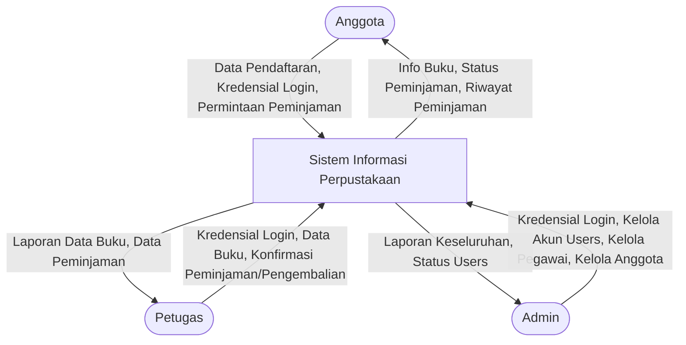
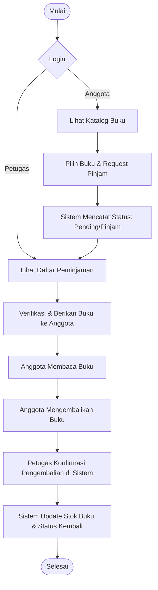
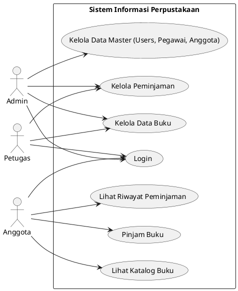
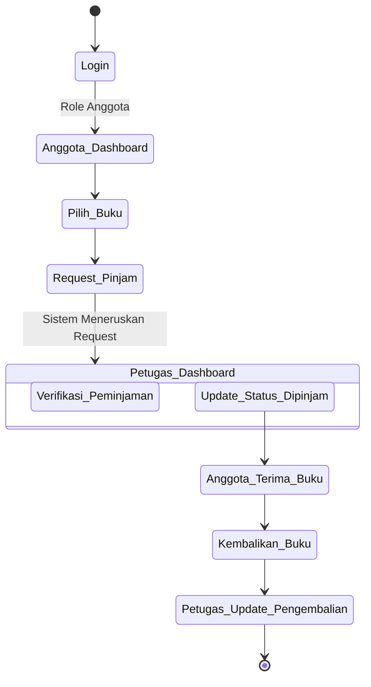
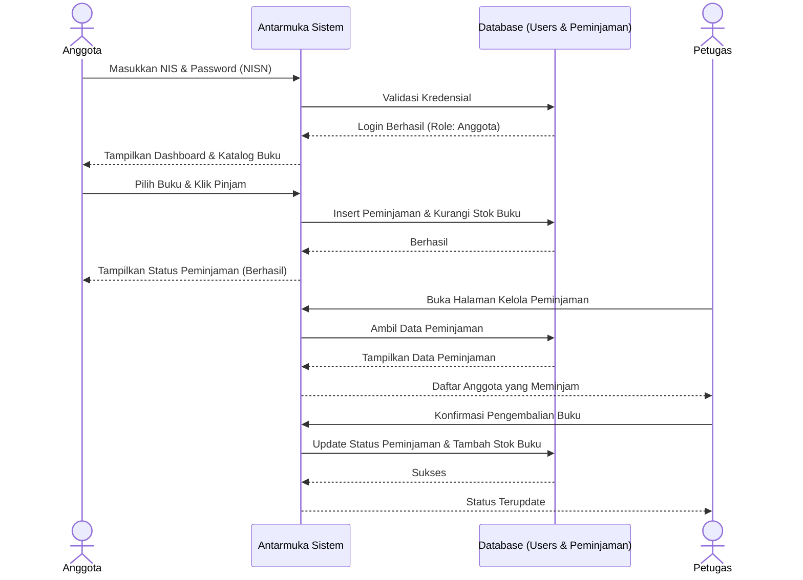
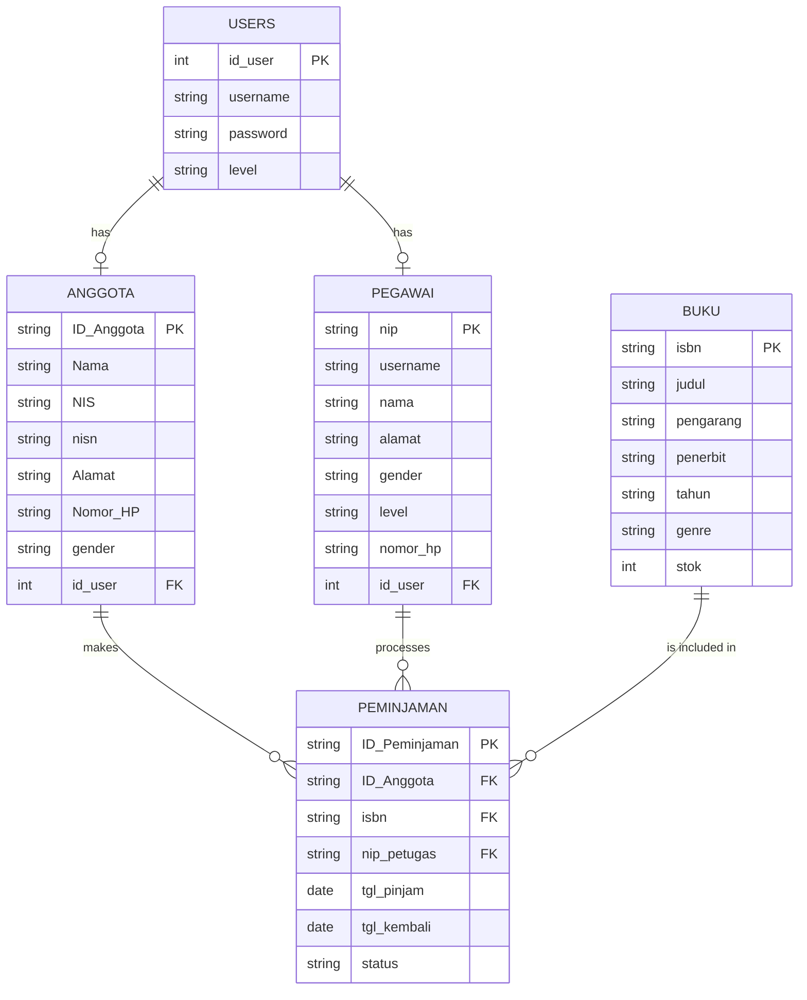

# Dokumentasi Sistem Informasi Perpustakaan Digital

Berikut adalah DFD Level 0, Flowchart Sistem, Use Case Diagram, Activity Diagram, Sequence diagram, dan Entity Relationship Diagram (ERD) untuk Sistem Informasi Perpustakaan Digital.

## 1. DFD Level 0 (Context Diagram)

## 2. Flowchart Sistem (Alur Peminjaman Buku)

## 3. Use Case Diagram

## 4. Activity Diagram (Peminjaman Buku)

## 5. Sequence Diagram (Proses Login dan Peminjaman)

## 6. Entity Relationship Diagram (ERD)

